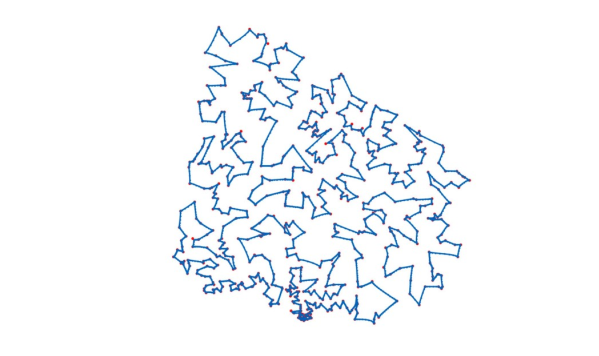

# Computational-Intelligence

## HW1

### Q2 - MLP

Design an MLP Network for the data below

  

Then, change the Learning rate, Epoch number, and Layer number. Which model is better?

Plot the Loss and Accuracy.
Plot Decision Boundary.

### Q3 - Keras

Design an MLP Network for CIFAR-10 classification.

Try using Momentum and Weight Decay.

## HW2

### Q1 - Kohonen

Design a Kohonen network for 5000 randomly chosen samples of MNIST.

### Q4 - RBF

Design an MLP and an RBF network for given data. Then compare them.

  

## HW3

### Q2 - Hopfield

Design a Hopfield network and train it on the Fashion MNIST dataset.

### Q3 - TSP

Solve TSP by one of these networks if possible:

1. MLP
2. SOM
3. RBF
4. Hopfield

Here is a sample output:

 

## HW4

### Q2 - Fuzzy

Design a Fuzzy network for predicting the result of a football match.

 

## HW5

### Q4 - Genetic Algorithm

Solve this equation by GA.

168x3 − 7.22x2 + 15.5x − 13.2 = 0

### Q5 - Ant Colony Algorithm

Solve Job Shop Problem by Ant Colony Algorithm.

